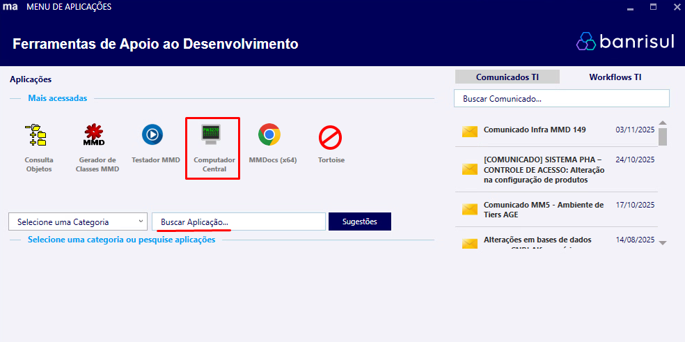
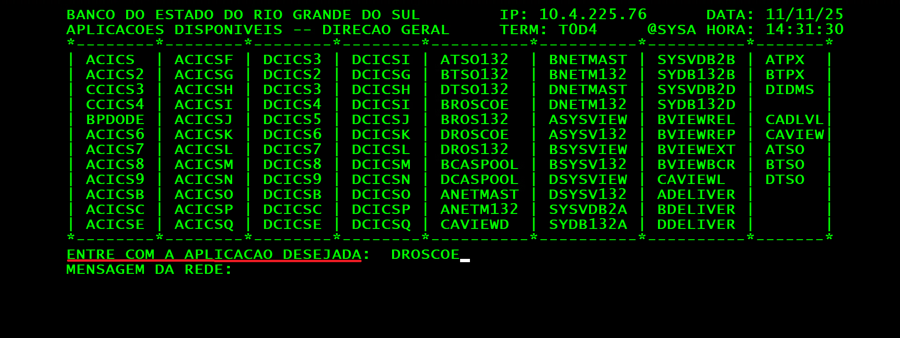
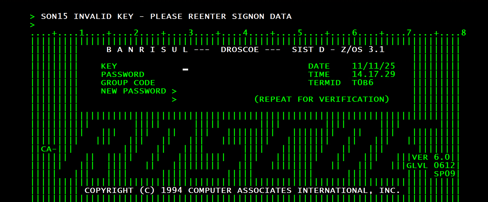

### Atualizando Senha RACF na Aplicação DROSCOE

Para acessarmos posteriormente o banco de dados do Banrisul pela aplicação **Consulta Objetos**, precisaremos primeiro atualizar a senha temporária **RACF** pessoal. O processo funciona por meio da aplicação **DROSCOE**, a qual acessamos pelo Computador Central e lá serão fornecidos dados 
pessoais como **matrícula** e a senha temporária mencionada.

---

### 1. Acessando o Computador Central

Rode o programa **PZP - Menu de Aplicações**, pois precisaremos da aplicação **Computador Central** que é acessível por meio do menu de aplicações.

O menu de aplicativos então irá aparecer. Você deve então abrir o programa **Computador Central** clicando em seu ícone, caso este já tenha aparecido na parte onde ficam presentes as aplicações mais acessadas, ou buscando pelo nome do programa um pouco mais abaixo no campo **"Buscar Aplicação..."**.

### 2. Acessando a Aplicação DROSCOE

Após o acesso ao **Computador Central** ter sido bem sucedido, a tela mostrada na imagem abaixo irá aparecer. Aqui, basta digitar a palavra **"DROSCOE"** no campo onde consta **"ENTRE COM A APLICACAO DESEJADA"**, não sendo necessário que a palavra seja digitada com letras maiúsculas. Após ter digitado, aperte enter.

**Observação: ao acessar o computador central pelo terminal, a digitação pode funcionar de forma diferente do que em outros programas. Por isso, preste bastante atenção ao que aparece na tela enquanto digita, para ter certeza de que o comando está sendo escrito exatamente como desejado. Além disso, não aperte as teclas direcionais, pois o cursor sairá das posições corretas e caso isso ocorrer aperte a tecla tab até o cursor ser reposicionado corretamente**

### 3. Realizando a Atualização da Senha

Ao acessar a aplicação **DROSCOE**, a tela da imagem abaixo aparecerá. Aqui, devemos seguir o seguinte passo a passso:
1) Digitar o número pessoal da matrícula no campo **KEY** e apertar a tecla tab. Após isso, perceberemos que o cursor desceu para o campo abaixo, o qual é o de **PASSWORD**.
2) Digite no campo de **PASSWORD** a sua senha temporária **RACF** e aperte tab.
3) Agora, para o campo **GROUP CODE**, não preencheremos nada e apertamos tab.
4) Finalmente, no campo **NEW PASSWORD**, digite a sua nova senha e aperte enter para concluir.

**Observação: foi observado que algumas pessoas ao acessar este sistema e executar o procedimento acima não conseguiram concluir o processo apertando a tecla enter, tendo sido concluído que para estas existe uma tecla alternativa que desempenharia a mesma função. Caso este for seu caso, tente as teclas ctrl e alt direitas (do lado direito do seu teclado).**

Após estes passos terem sido concluídos a senha terá sido atualizada com sucesso.

