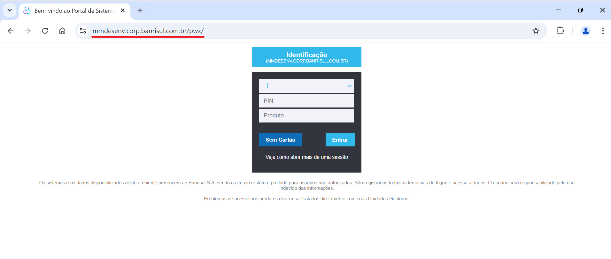
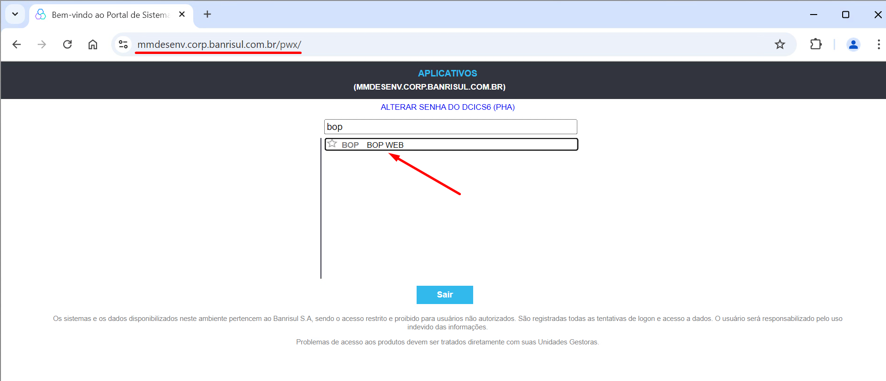
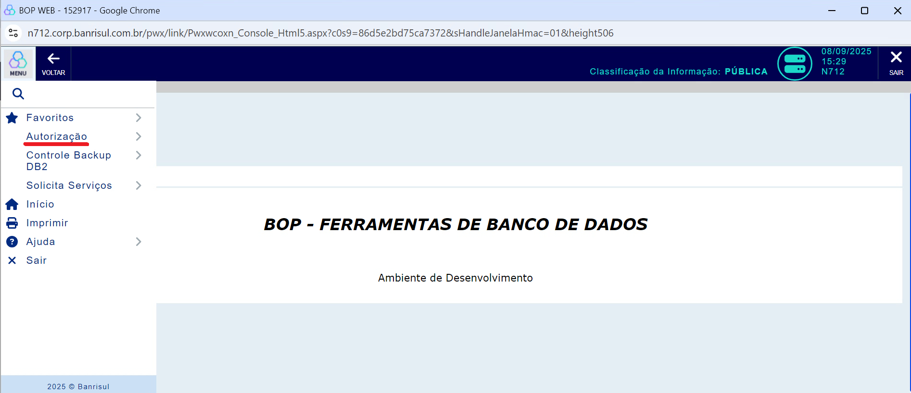
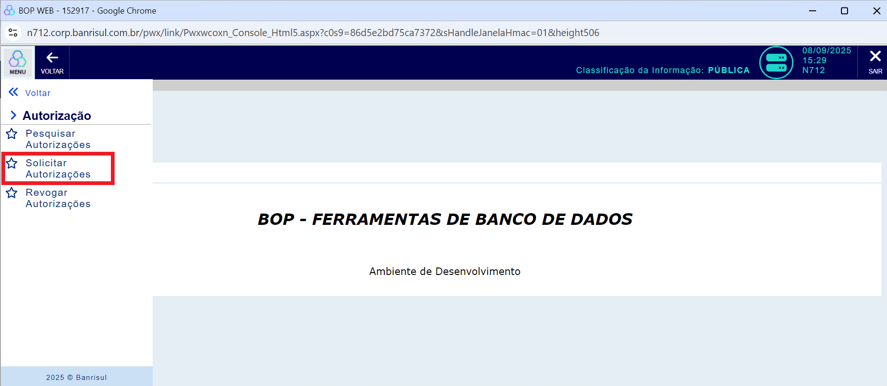
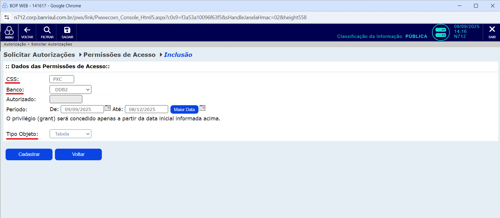
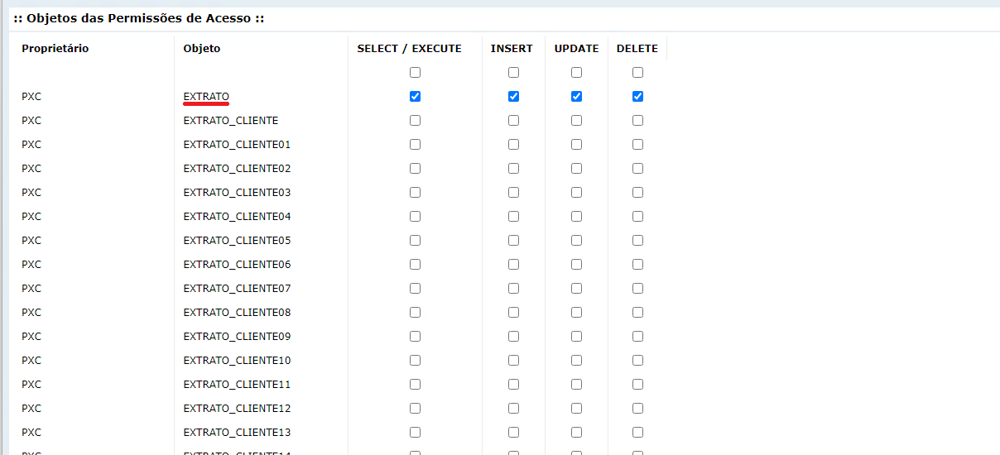
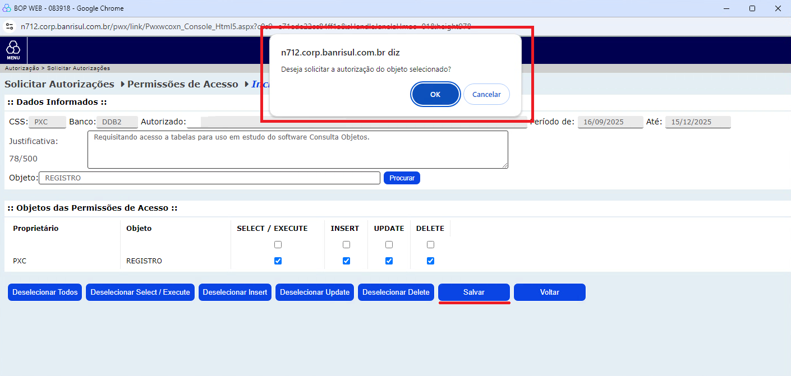

### Requisitando Acesso a Tabelas

Para realizarmos operações de leitura nas tabelas presentes no banco DB2 do Banrisul, precisaremos pedir permissão. O processo funciona por meio do sistema **BOP WEB**, onde apontaremos as tabelas que queremos adquirir o acesso e registraremos o pedido.
Após o pedido ter sido feito precisaremos esperar um pouco, pois o processo de atendimento das requisições não é instantâneo. Mesmo assim, caso acabar levando muito tempo, talvez seja necessário contactar o Help Desk.

---

### 1. Acesse a página do BOP

Acesse o link mmdesenv.corp.banrisul.com.br/pwx/ e, após a página carregar e obter os dados da sua matrícula pelo cartão de acesso,
preencha a sua senha no campo **pin**, mantendo o campo **produto** em branco.

O menu de aplicativos então irá aparecer. Você deve escolher a opção **BOP WEB**.

### 2. Solicitando Autorização

Após a página do **BOP WEB** ter aberto, clique em "Autorização" no menu lateral esquerdo.

Selecione agora a opção "Solicitar Autorizações".

Preencha o campo **CSS** com o valor **PXC** e selecione **DDB2** no campo **Banco** e **Tabela** no campo **Tipo Objeto**. Após fornecer as informações necessárias, clique em **Cadastrar**.

Preencha o campo **CSS** com o valor **PXC** e selecione **DDB2** no campo **Banco** e **Tabela** no campo **Tipo Objeto**. Após fornecer as informações necessárias, clique em **Cadastrar**.

Agora, a tela de seleção de tabelas e operações irá aparecer. O primeiro passo aqui é preencher o campo **Justificativa** com a razão de estarmos requisitando acesso às tabelas que escolheremos em seguida. Aqui não
existe um valor específico necessário, mas colocaremos "Requisitando acesso a tabelas para uso em estudo do software Consulta Objetos.", por exemplo. Agora devemos buscar as tabelas **EXTRATO**, **REGISTRO** e **TIPOREGISTRO** nos
**Objetos das Permissões de Acesso** e selecionar todas as operações relacionadas a elas.

Para selecionar as operações desejadas em cada tabela, basta clicar na respectiva checkbox.

Caso as tabelas desejadas não estejam na mesma página, elas terão que ser requisitadas separadamente (marcar as operações de uma tabela e procurar por outra nas páginas seguintes desmarca o que foi selecionado na primeira tabela). 
Após selecionar a tabela desejada, basta clicar no botão "Salvar" que está localizado abaixo da lista de tabelas e, após ter clicado, uma mensagem de confirmação aparecerá, bastando clicar em "Ok" para concluir o processo.

**Como dito anteriormente, repita o processo da solicitação até ter requisitado todas as tabelas necessárias (`CATEGORIA`, `CLIENTE_PXC`, `CONTRATO`, `EXTRATO`, `IDIOMA`, `REGISTRO` e `TIPO_REGISTRO`).**

> Nota: A tabela `TIPO_REGISTRO` pode estar fora de alcance devido a instabilidades no sistema BOP Web. Nesse caso, acione o time do treinamento e os comunique para que façam o pedido diretamente ao time de bancos de dados do Banrisul.

Após estes passos terem sido concluídos teremos já conseguido acesso a todas as tabelas necessárias e damos o processo como encerrado.
